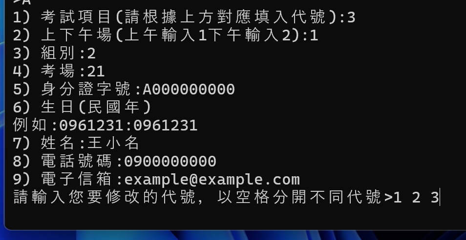
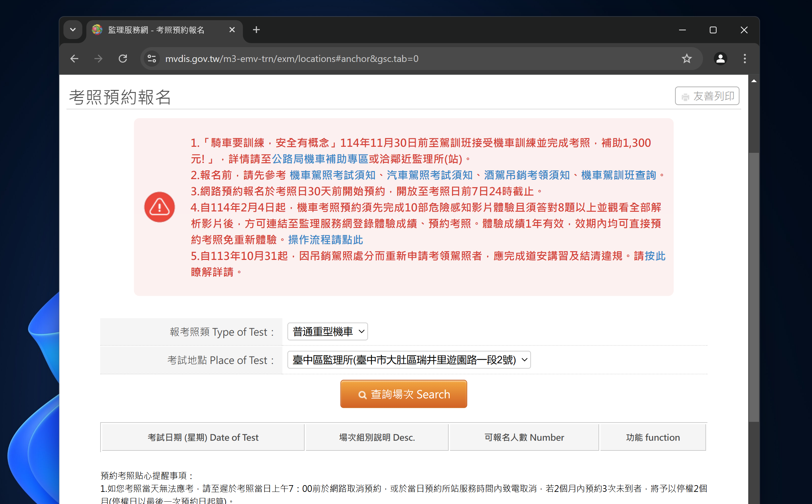
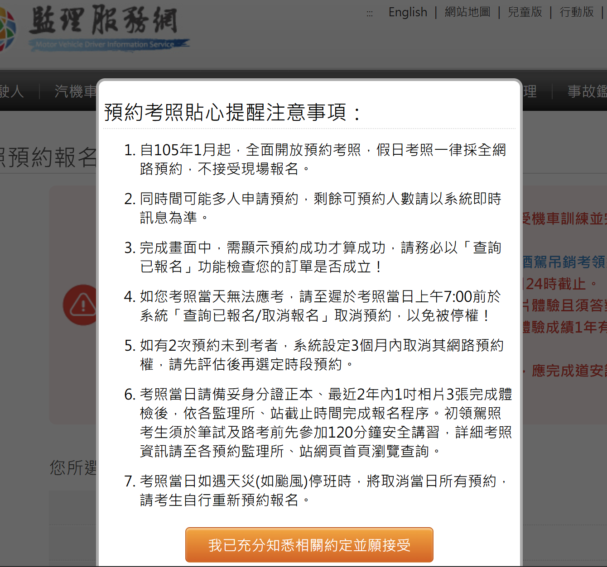
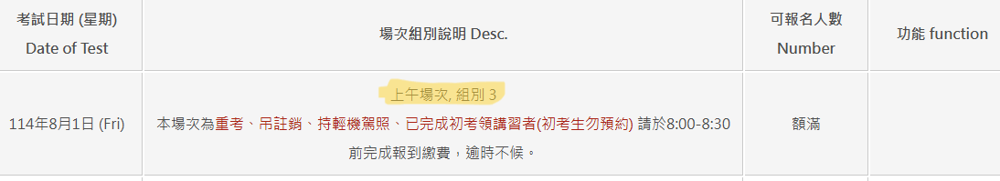

# SwiftPass

本軟體旨在自動化報考駕照的流程，透過精準計時和加速提交，提高您在熱門考場或名額有限時段成功報考的機會。
> [!IMPORTANT]
> 請先參見[免責聲明](#免責聲明)，閱讀完內容並且同意後再進行使用。

## 目錄
- [SwiftPass](#swiftpass)
  - [目錄](#目錄)
  - [快速開始](#快速開始)
  - [下載](#下載)
  - [說明](#說明)
  - [資料](#資料)
    - [考試項目代號](#考試項目代號)
    - [上午或下午場](#上午或下午場)
    - [組別](#組別)
    - [考試地點代碼](#考試地點代碼)
    - [姓名](#姓名)
    - [身分證字號](#身分證字號)
    - [生日(請使用民國年，ex:0780101)](#生日請使用民國年ex0780101)
    - [手機號碼](#手機號碼)
    - [email](#email)
  - [免責聲明](#免責聲明)

## 快速開始

1. 前往 [release](https://github.com/jason355/SwiftPass/releases) 頁面尋找最新版，下載 `.7z` 檔案
2. 解壓縮後雙擊 `main.exe`
3. 根據畫面指示輸入資料
4. 選擇執行模式（A 修改資料 / B 單視窗執行 / C 多視窗）

> 詳細設定請參見下方說明

## 下載
請點選右側[release](https://github.com/jason355/SwiftPass/releases/)頁面，點選Assets下方`SwiftPass <version>.7z`下載。

- 解壓縮`SwiftPass <version>.7z`
- 進入資料夾會看到`main.exe`與`_internal`資料夾
- 雙擊`main.exe`即可啟動程式。

## 說明

初次使用本軟體，會需要輸入[相關資料](#資料)，請依據提示輸入準備好的資料。

資料輸入完成後，會看到有`A`、`B`與`C`三個選項，
- `A 修改資料` 

    輸入A並按下ENTER後，你會看到1-9個資料選項，輸入需要修改的項目代碼後按下ENTER送出。若誤按到`A`可不輸入任何數字直接按下ENTER跳出此選項。
#### [圖1] A 修改資料範例。

- `B:單視窗執行` 
  
    單視窗執行，程式會先開啟瀏覽器並且載入初始畫面(圖2)計算與開放日時間差(隔日00:00:00)，並且延遲該時間差，程式會根據您預估的網路延遲和伺服器響應時間 (span)，提前 10 毫秒觸發提交，以確保請求在開放時間點準確抵達伺服器。故實際送出時間為當日23:59:59.990。
    送出請求後，會跳轉至另一網頁，若正確載入(見下圖3)則會自動填入預設資料並且提交，但若未正確載入則需手動輸入資料(包含身分證、生日、姓名、手機號碼、email)。

#### [圖2] 初始畫面

#### [圖3] 正確載入畫面
  

- `C 雙視窗執行`
  
    原則上與單視窗執行相同，不過此選項會開兩個視窗`DriverProgress:10`與`DriverProgress:-10`，分別提前10毫秒與延後10毫秒送出請求，若電腦性能允許請以此方法為主。(建議依據瀏覽器回應時間判斷是否使用)
> [!NOTE]
> 建議硬體規格
>   - 處理器:Intel i3 (第八代或更新) 或  AMD Ryzen 5 (第 3 代或更新) 或更高階處理器
>   - 記憶體 4 GB 以上
>   - 有線網路

> [!IMPORTANT]
> - 請提前做完安全感之測驗
> - 本系統以程式啟動當天往後算30天作為考試日期
> - 建議將電腦的睡眠設定為永不休眠，或確保在程式運行期間電腦不會進入睡眠模式。

> [!NOTE]
> - 建議提至少提前5-10分鐘開啟此程式，避免資料有誤或其他問題需要解決
> - 若使用筆電，請確保其電力充足。建議連接上電源

## 資料
請先準備好以下資料
### 考試項目代號
  請根據下方對應表，確認考試項目代號
| 考試項目       | 代號 |
| :--------------- | :--- |
| 普通重型機車     | 3    |
| 普通輕型機車 (50cc 以下) | 5    |
| 普通小型車       | A    |
| 職業小型車       | B    |
| 普通大貨車       | C    |
| 職業大貨車       | D    |
| 普通大客車       | E    |
| 職業大客車       | F    |
| 普通聯結車       | G    |
| 職業聯結車       | H    |

### 上午或下午場
  1 代表上午，2 代表下午
### 組別
  請至[監理站考照報名](https://www.mvdis.gov.tw/m3-emv-trn/exm/locations#gsc.tab=0)選擇您的考試項目、並任選一天作為考試日期(建議選擇平日)，最後選擇考場後找到下方欄位之組別代號，通常有兩個，一個給重考、註銷者，另一個給初考生
#### [圖4] 上下午場與組別確認
  

### 考試地點代碼
  請參考下方對應表，找到您的考場代號
| 監理站 (地址)                               | 代號 |
| :-------------------------------------------- | :--- |
| 士林監理站(臺北市士林區承德路5段80號)        | 21   |
| 基隆監理站(基隆市七堵區實踐路296號)           | 25   |
| 金門監理站(金門縣金湖鎮黃海路六之一號)        | 26   |
| 連江監理站(連江縣南竿鄉津沙村155號)           | 28   |
| 台北區監理所(新北市樹林區中正路248巷7號)       | 40   |
| 板橋監理站(新北市中和區中山路三段116號)        | 41   |
| 宜蘭監理站(宜蘭縣五結鄉中正路二段9號)          | 43   |
| 花蓮監理站(花蓮縣吉安鄉中正路二段152號)        | 44   |
| 玉里監理分站(花蓮縣玉里鎮中華路427號)          | 45   |
| 蘆洲監理站(新北市蘆洲區中山二路163號)          | 46   |
| 新竹區監理所(新竹縣新埔鎮文德路三段58號)       | 50   |
| 新竹市監理站(新竹市自由路10號)                 | 51   |
| 桃園監理站(桃園市介壽路416號)                | 52   |
| 中壢監理站(桃園縣中壢市延平路394號)           | 53   |
| 苗栗監理站(苗栗市福麗里福麗98號)               | 54   |
| 臺中區監理所(臺中市大肚區瑞井里遊園路一段2號)    | 60   |
| 臺中市監理站(臺中市北屯路77號)                 | 61   |
| 埔里監理分站(南投縣埔里鎮水頭里水頭路68號)       | 62   |
| 豐原監理站(臺中市豐原區豐東路120號)             | 63   |
| 彰化監理站(彰化縣花壇鄉南口村中山路二段457號)    | 64   |
| 南投監理站(南投縣南投市光明一路301號)           | 65   |
| 嘉義區監理所(嘉義縣朴子市朴子七路29號)           | 70   |
| 東勢監理分站(雲林縣東勢鄉新坤村新坤路333號)      | 71   |
| 雲林監理站(雲林縣斗六市雲林路二段411號)          | 72   |
| 新營監理站(臺南市新營區大同路55號)               | 73   |
| 臺南監理站(臺南市崇德路1號)                     | 74   |
| 麻豆監理站(臺南市麻豆區北勢里新生北路551號)        | 75   |
| 嘉義市監理站(嘉義市東區保建街89號)               | 76   |
| 高雄市區監理所(高雄市楠梓區德民路71號)           | 30   |
| 苓雅監理站(高雄市三民區建國一路454號)            | 31   |
| 旗山監理站(高雄市旗山區旗文路123-1號)             | 33   |
| 高雄區監理所(高雄市鳳山區武營路361號)            | 80   |
| 臺東監理站(臺東市正氣北路441號)                 | 81   |
| 屏東監理站(屏東市忠孝路222號)                   | 82   |
| 恆春監理分站(屏東縣恒春鎮草埔路11號)             | 83   |
| 澎湖監理站(澎湖縣馬公市光華里121號)             | 84   |

### 姓名
### 身分證字號
### 生日(請使用民國年，ex:0780101)
### 手機號碼
### email

## 免責聲明

**重要提醒：**

本軟體僅為**學習與個人研究用途**，旨在探討自動化技術在特定網路服務上的應用。使用本軟體前，請務必詳閱並遵守您所操作網站（例如交通部公路總局監理服務網）的**所有服務條款、使用規範及相關法規**。

本軟體作者：
* **不保證**本軟體在任何情況下皆能成功執行或達到預期效果。
* **不承擔**因使用本軟體而導致的任何直接或間接的損失、損害、法律責任或任何後果（包括但不限於帳號被封鎖、報名失敗、資料外洩等）。
* **不鼓勵或支持**任何違反網站服務條款、惡意攻擊、非法佔用資源或不道德的行為。

您**必須自行評估並承擔**使用本軟體的所有風險。若您不同意上述條款，請立即停止使用本軟體。
